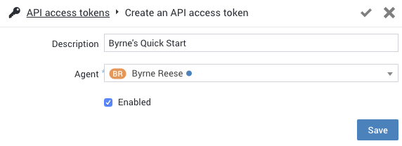

# Obtain an API Access Token

Before calling the RingCX Digital REST API, create an API access token for your application.

## How API access tokens work

An API access token authenticates requests to the RingCX Digital REST API. The token is associated with a RingCX Digital user, and API requests made with the token act with that user's permissions.

An API access token remains valid while it is enabled. Disable or delete a token when the integration no longer requires access.

!!! warning "Protect API access tokens"
    Treat an API access token like a password. Store it in a secrets manager or environment variable, do not commit it to source control, and do not include it in logs or URLs.

## Create an API access token

You must have the **Manage API access tokens** permission to create or manage API access tokens.

1. Sign in to RingCX Digital and open **Admin**.
2. Select **API access tokens**.
3. Click **+** to create a token.
4. Enter a descriptive name and select the user the integration will act on behalf of.
5. Make sure the token is enabled, and then save it.

Use a dedicated user with only the permissions required by the integration. If that user's permissions change, the token's effective permissions change as well.

To send the token with an API request, see [Authenticating to the RingCX Digital API](auth.md).
