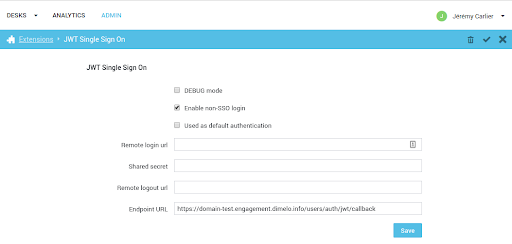

# Single Sign-on Using JWT

Single sign-on (SSO) is an authentication process which allows our clients to authenticate users on their systems and then tell Engage Digital who that user is. In effect, this allows users to log in only once and then be able to use Engage Digital without having to use their credentials again.

There are a few key benefits to using SSO:

* reduces password fatigue - users don’t have to remember multiple credentials, which reduces stress and increases security
* reduces time spent logging into the system
* allows the client to implement uniform authentication policies


### JWT

To enable SSO we use a secure protocol, called JSON Web Token (JWT), of transferring user authentication data from the client systems to Engage Digital.  JWT is a fairly recent standard, but it is open, simple and with strong support. You can read more about it on the [IETF website](http://tools.ietf.org/html/draft-jones-json-web-token-10) and you’ll be able to find a large number of open source implementations for most languages. You can find a JWT example [below](./#example-token).

## Configuration

In order to benefit from SSO you will need to add the extension and properly configure it in the administration interface. Here’s a short explanation of what each of these fields means:

* **Remote login url**: we will redirect the user to this URL if he hits our application unauthenticated. At this endpoint you will have to log the user in and then redirect him back to us. Please also read about the [*return_to* parameter](./#return_to-parameter).
* **Shared Secret (mandatory)**: this is a random string that will be used by you to encode and sign the JWT token and by us to check its integrity. You will need to keep this secure - if compromised you will need to generate a new one and start using it in your implementation as well.
* **Remote logout url (optional)**: after the user signs out from our application we will redirect him to this URL. This will make it possible for you to sign him out from all other systems.
* **Endpoint URL**: this is a read-only field, meant to show you where your implementation should redirect with the JWT token after the user has authenticated into your system. This always has the form: 

``` html
https://your-subdomain.digital.ringcentral.com/users/auth/jwt/callback?jwt={jwt_payload}
```

### Enable Non-SSO Login (Having Two Ways to Login)

!!! Note
    This option can only be disabled if you configured a Remote login URL.

Once you enable SSO, all unauthenticated users that visit a page will get redirected to the "*JWT Remote login*" url. But, if the checkbox "*Enable non-SSO login*" is enabled, users will still be able to login using their Engage Digital credentials by visiting:

``` html
https://your-subdomain.digital.ringcentral.com/login
```

directly. If you want your users to only be able to log in through the SSO you will need to disable this checkbox - once you do, users can still see the form on */login*, but they will not be able to log in anymore. Be careful though, this means that no one will be able to log in if the SSO is down for some reason.



### Used as Default Authentication

!!! Note
    Only one type of SSO can be used as default authentication at a time.

!!! Important 
    This option can only be enabled if you configured a *Remote login URL*.

Once the JWT SSO is enabled and configured you can choose to use it as the default authentication method, which means that whenever a user visits 

``` html
https://your-subdomain.digital.ringcentral.com
```

he will be redirected to the configured *Remote login url*.

### User Configuration

When authenticating with JWT the given Engage Digital user will be matched **first** by his `JWT external ID`,

!!! note "Please note" 
    This field will only be visible in the admin *if JWT is enabled on the domain*

and then by his `External ID`, which can be set in the user configuration part of the admin:


### Authentication Process

Here are the steps for a user to become authenticated within Engage Digital using SSO:

1. An authenticated user tries to access a page of Engage Digital.
2. Our application acknowledges that SSO is enabled for this domain and will redirect the user to the *JWT Remote login URL*.
3. The user is authenticated on your side.
4. A JWT token is built using the *JWT shared secret* and user data.
5. The user is redirected back to Engage Digital JWT Endpoint URL.
6. We make sure the JWT data is valid and authenticate the user, identified by the `external_id` provided in the token (must either match the user’s `JWT external ID` or his `External ID`), within Engage Digital.


This flow allows for the authentication to be completely decoupled from Engage Digital, without hindering the user experience. If the user was already authenticated on your side, he will not even notice the back and forth and will have the desired page loaded seemingly directly.

## JWT Implementation

The JWT specification allows for a variety of signing algorithms and does not mandate any attributes to be passed in the tokens. Below you can find all required details to correctly implement JWT on your side.

### Supported Signing Algorithms

We handle JWTs signed with the following algorithms:

| Algorithm | Header value ("alg") |
|-|-|
| HMAC SHA-256 | HS256 |
| HMAC SHA-384 | HS385 |
| HMAC SHA-512 | HS512 |

!!! Note
    None of the RSA (eg. RSA SHA-256) or ECDSA (eg. ECDSA P-256 SHA-256)  algorithms are suported.

### Supported Attributes

| Attribute | Mandatory | Description |
|-|-|-|
| `iat` | Yes | (Issue At) The time when the token was generated, encoded as [UNIX time](http://en.wikipedia.org/wiki/Unix_time#Encoding_time_as_a_number). The token will be considered invalid after 5 minutes. |
| `jti` | Yes | (JWT ID) A random string used to prevent token replay attacks. |
| `external_id` | Yes | String that will uniquely identify the user being signed in. |

### Example Token

!!! Note
    In all examples below, Base64url encoding means the Base64 encoding described in Section 5 of RFC 4648 with the `=` padding characters omitted.

Let’s say a user, John Doe, with the id “123456” authenticated on “Fri, 14 Jun 2013 18:20:12 CEST +02:00” and the random `jti` value is “d6cB445c1eG6512p”. This means that the JWT payload is a JSON object with the following structure:

``` json
{
    "iat": 1371223212,
    "jti": "d6cB445c1eG6512p",
    "external_id": "123456"
}
```

Base64url encoding the payload (with all whitespace removed) we get:

`eyJpYXQiOjEzNzEyMjMyMTIsImp0aSI6ImQ2Y0I0NDVjMWVHNjUxMnAiLCJleHRlcm5hbF9pZCI6IjEyMzQ1NiJ9`

By using HMAC SHA-256 signing the header will look like this:

``` json
{
    "typ": "JWT",
    "alg": "HS256"
}
```

Base64url encoding  the header (with all whitespace removed) we get:

`eyJ0eXAiOiJKV1QiLCJhbGciOiJIUzI1NiJ9`

Next we’ll have to compute the HMAC SHA-256 digest (note: not hexdigest) of the string obtained from concatenating the encoded strings with a dot:

``` html
header_base64_encoded.payload_base64_encoded
```

The Base64url encoded signature will make up the last part of the token. In our case, assuming a shared secret of “secret”, this is:

`cIrf70IOkcNjc5ScplJidG1WNFHgAw39MAOjp3WNatU`

So the final JWT token will be:

`eyJ0eXAiOiJKV1QiLCJhbGciOiJIUzI1NiJ9`*.*`eyJpYXQiOjEzNzEyMjMyMTIsImp0aSI6ImQ2Y0I0NDVjMWVHNjUxMnAiLCJleHRlcm5hbF9pZCI6IjEyMzQ1NiJ9`*.*`cIrf70IOkcNjc5ScplJidG1WNFHgAw39MAOjp3WNatU`

### *return_to* Parameter

To allow for a seamless integration, when we redirect to the *remote login url* (step 2 in authentication process) we also pass a *return_to* query parameter containing the URL the user tried to access. When you redirect back to our application (step 5 in authentication process), you can also pass this *return_to* query parameter (in addition to the `jwt`) and we will use it to redirect the user to the initial page he tried to access.

!!! Note
    This is entirely **optional** - if you don’t pass a *return_to* parameter when you redirect back to our application we will simply redirect the user to Engage Digital homepage - but it’s a simple way to enhance user experience.

### Error Handling

If there is any kind of error when processing the JWT token we will redirect the user back to the remote login URL with an *error* query parameter set to one of the following:

| Error Type | Description |
|-|-|
| `token_invalid` | We could not decode the token or the token signature was incorrect. |
| `token_expired` | The token `iat` occurred more than 5 minutes ago. Please make sure your system uses NNTP or something similar to keep your system time up to date. |
| `token_missing_attribute` | One of the token attributes (`external_id`, `iat`, `jti`) is missing or is blank. |
| `token_replay` | We received another token with the same jti in the last 5 minutes. |
| `user_not_found` | We could not find any user with the given `external_id`. Please make sure to first create the user on Engage Digital side as well. |
