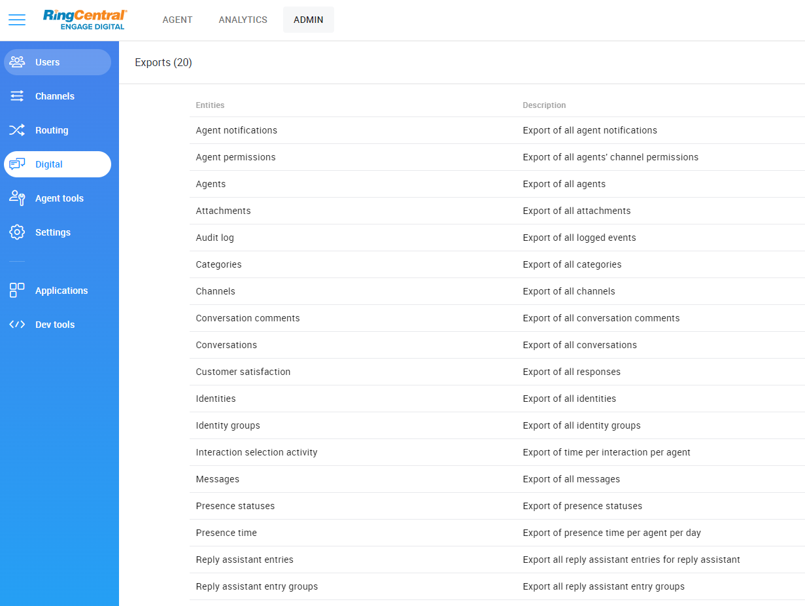
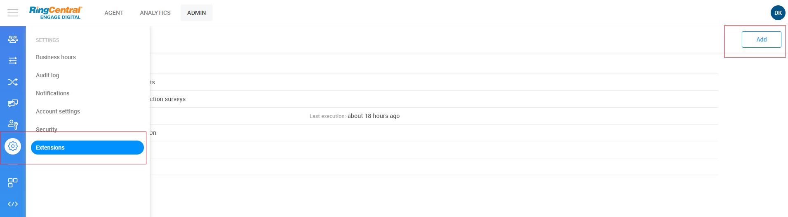
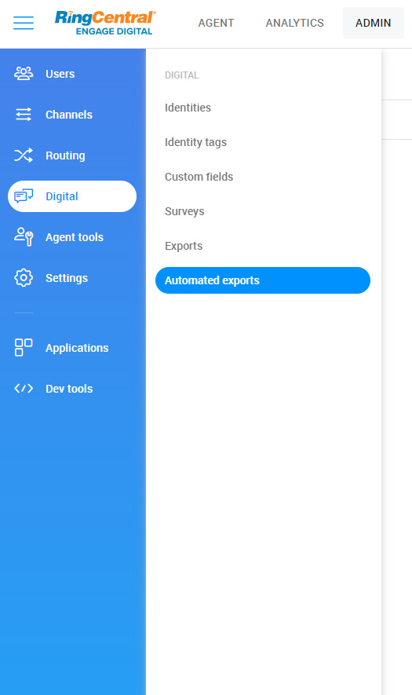
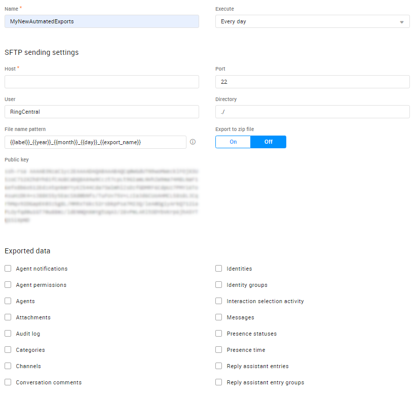
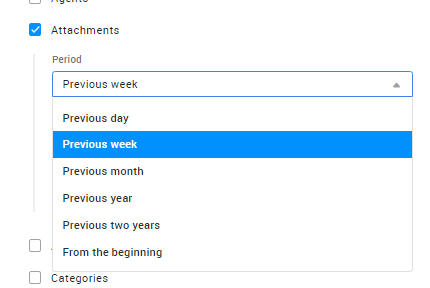
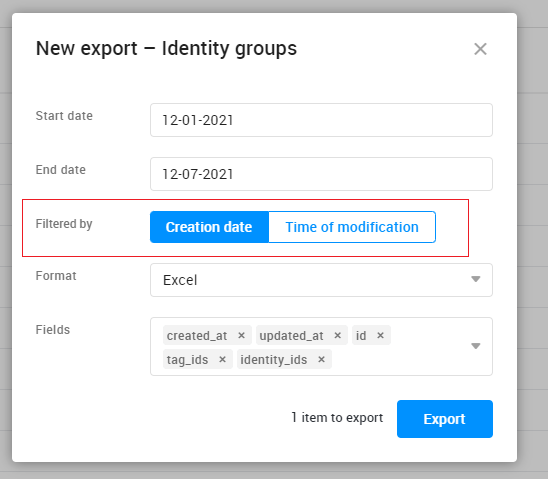
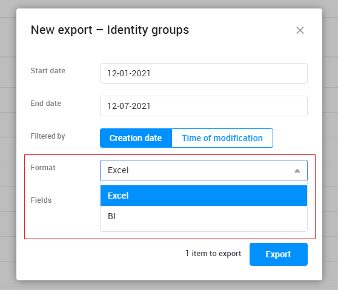
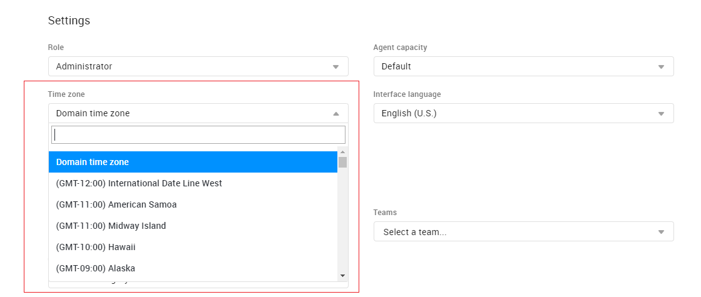
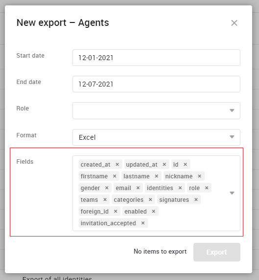

# Overview

RingCentral Engage Digital exports makes it easy to export RingCentral Engage Digital data as a comma-separated values (CSV) file.

The goal of csv export is to help your company integrate Engage Digital Data into your own IT solution like: CRM, Business Intelligence tools or more…. 

From contents to identities, RingCentral Engage Digital lets you export all your most important data in one interface.

There are 2 ways to export data as CSV in RingCentral Engage Digital:

- Manual
- Automated

!!!important
    Exports fields info is in [Main Export Fields](./main-export-fields.md) and [Extensions Report Fields](./extensions-report-fields.md)

## Manual Exports

Manual exports are useful when you want to filter the data given a certain date, format, team or category.
Exports can be found under Admin > Digital > Exports.

!!!info
    Exports are processed in background and sent by email as an attached file to the requester.



## Automated Exports

!!!info
    To turn on automated exports, admin user needs to add `Automated Exports` extension.



Exports can be automated to minimize the time and effort involved in the integration process of your BI(Business Intelligence) system, CRM or backup. Automated exports are sent in the BI format (see [Encoding and format](#encoding-and-format)).

This approach involves providing a deployment location and access by SFTP.

Exports will be uploaded periodically to the specified location either :
- everyday
- every monday
- every 1st of the month



To have automatic exports available, you must have a specific extension enabled. Please contact your RingCentral Engage Digital project manager if you don’t have it. You will be able to add as many automatic export tasks as you want. Here is how you can configure an automatic export task:

- `Name`: the name of the export task, this name will be used to determine export filename.
- `Host`: the server where the filename will be exported.
- `Port`: the port for the SSH connection. 22 by default.
- `User`: the user for the SSH connection.
- `Directory`: the destination directory of the export file. This folder must exist and the user used for the SSH connection must have "read" and "write" permissions. 
- `File name pattern`: pattern for the exported file name. This allows customization based on the following variables:
    - `label`: The label of the export task, this name will be used to determine export filename
    - `year`: Current year at export time (e.g 2015)
    - `month`: Current month at export time (e.g 07)
    - `day`: Current day at export time (e.g 27)
    - `export_name`: Name of the export (agents, messages, roles, etc…) - Only available when not using zip
- `Export to zip file`: whether or not the exports should be zipped in a single file, or transferred individually.
- `Public key`: the RingCentral Engage Digital SSH key used for the connection. This key is provided by on demand. It is mandatory to have this key in the ~/.ssh/authorized_keys file on the server in order to have a successful connection.



When not using the `Export to zip file` option, the export_name variable is replaced by the following for each individual export:

| Export                         | export_name                    |
|--------------------------------|--------------------------------|
| Agents                         | agents                         |
| Agents notifications           | agents_notifications           |
| Agents permissions             | agents_permissions             |
| Categories                     | categories                     |
| Identities                     | identities                     |
| Identity groups                | identity_groups                |
| Intervention’s comments        | interventions_comments         |
| Intervention’s segments        | interventions_segments         |
| Interventions                  | interventions                  |
| Audit Log                      | journal                        |
| Messages                       | messages                       |
| Presence time                  | presence_time                  |
| Roles                          | roles                          |
| Sources                        | sources                        |
| Threads                        | threads                        |
| Reply Assistant Knowledge Base | reply_assistant-knowledge_base |

Depending on the export type, an option can be shown to make it incremental or complete. When this option is available, one can choose to export the elements created during the past day/week/month or to export everything for each new export. You can find in the export description `incremental availability` whether or not an export supports that option.



If the option is not available, the export will always be complete.

## Time Filtering

By default, exports are filtered by creation time. The begin and end date selected will then be related to this value. However, some exports can also be filtered by update time instead(eg. `Conversations`). This information is available on each specific export section of the current document.

Filtering by creation time allows joining data from different exports. Indeed, when exporting two different types of data from the same period (e.g. Interventions and Identities) with a time filtering by creation time, the references present in one export might be missing in the other one (e.g. if an intervention was created on 08-30-2016 and the related identity was created on 06-15-2016, an export from the 08-25-2016 to the 09-15-2016 will include the intervention but not the identity).



## Encoding and Format



| Format | Encoding | Bom   | Strip line breaks | iso8601 (date & datetime format) | CSV Column Separator |
|--------|----------|-------|-------------------|----------------------------------|----------------------|
| BI     | UTF-8    | false | false             | true                             | ,                    |
| Excel  | UTF-8    | true  | false             | false                            | en , fr ;            |

## Locale

Depending on the locale (language) configured in your RingCentral Engage Digital user account and the export format, the csv export will display with a different format, separator… The purpose is to be compatible with Microsoft Excel expectation that depends on locale.

**Note**: BI has a specific format for certain columns to be easier to process by computers, if not it will fallback to English format.

Please find the column types that are locale dependent in the following table :

|  Column type / Format | BI                     | Windows EN       | Windows FR       | Mac EN           | Mac FR           |
|-----------------------|------------------------|------------------|------------------|------------------|------------------|
| Boolean               | 1 / 0                  | true / false     | vrai / faux      | true / false     | vrai / faux      |
| Date                  | 2013-09-24             | 09-24-2013       | 24/09/2013       | 09-24-2013       | 24/09/2013       |
| Datetime              | 2013-09-24T19:00+00:02 | 09-24-2013 19:00 | 24/09/2013 19:00 | 09-24-2013 19:00 | 24/09/2013 19:00 |
| Float                 | 12.8                   | 12.8             | 12,8             | 12.8             | 12,8             |

## Column Types

List of all column type available in exports

| Type     | Example                                                                  | Description                                                                                                                                                                                                                                                          |
|----------|--------------------------------------------------------------------------|----------------------------------------------------------------------------------------------------------------------------------------------------------------------------------------------------------------------------------------------------------------------|
| Array    | My Facebook Page, My twitter Page                                        | represents a collection of elements, which can be string, objectId, etc...                                                                                                                                                                                           |
| Boolean  | true                                                                     | Boolean can be  Excel  : ‘true’ / ‘false’ or ‘vrai’ / ‘faux’ BI : 1 / 0                                                                                                                                                                                              |
| Date     | 24/09/2013                                                               | Date Format changes depending on your language & format you choose Excel : fr : "%d/%m/%Y" 24/09/2013 en : "%m-%d-%Y" 09-24-2013 BI :  "%Y-%m-%d" 2013-09-24 [ISO8601](https://en.wikipedia.org/wiki/ISO_8601)                                                                                                 |
| Datetime | 24/09/2013 19:00                                                         | represents an instant in time, typically expressed as a date and time of day. Format changes depending on your language Excel : fr : "%d/%m/%Y %H:%M" 24/09/2013 19:00 en : "%m-%d-%Y %H:%M" 09-24-2013 19:00 BI :  "%Y-%m-%d %H:%M%z" 2013-09-24T19:00+00:02[ISO8601](https://en.wikipedia.org/wiki/ISO_8601) |
| Integer  | 12                                                                       | number that can be written without a fractional or decimal component                                                                                                                                                                                                 |
| ObjectId | 523ffffb7aa58d1b6700000f                                                 | an unique 12-byte BSON type identifier                                                                                                                                                                                                                               |
| String   | “my Facebook Post title”                                                 |                                                                                                                                                                                                                                                                      |
| Text     | “Hi, I cannot make phone calls using my new sim card… Can you help me ?” |                                                                                                                                                                                                                                                                      |
| Float    | 12,5                                                                     | represent a number with decimal component. The separator depend on your language: Excel : fr : , en : . BI : .                                                                                                                                                       |

**Note**: Excel has limits for cells and titles. A cell should not exceed 32767 characters and a title 255 characters. [Check here](https://support.microsoft.com/en-us/office/excel-specifications-and-limits-1672b34d-7043-467e-8e27-269d656771c3?ui=en-us&rs=en-us&ad=us) for more information.

## Datetime and Time Zones

Exports datetime fields are displayed in the user’s timezone. If the user has no time zone specified in his profile, the domain global time zone will be applied.

**Note**: This does not apply for automated export, it will use **BI** format.



Example of export raw file :

```html
# columns
created_at;source_id;source_type;source_name;content_thread_id;type;id;private_message;created_from;status;ignored_from;categories;intervention_id;creator_id;creator_name;author_id;author_name;body;title;foreign_id;foreign_categories

# data
01/10/2013 08:35;523ffe057aa58d181f0000de;Tapatalk;LesMobiles;524a6db90f4ca18aec00002c;Réponse publique;524a6db90f4ca18aec00002b;Non;synchronizer;Nouveau;"";Commercial Centre de tri;"";"";"";524a6db90f4ca18aec00002a;scarcore;Bonjour

01/10/2013 09:19;523ffe057aa58d181f0000de;Tapatalk;LesMobiles;524a6db90f4ca18aec00002c;Réponse publique;524a77730f4ca1bdba000042;Non;synchronizer;Nouveau;"";Commercial Centre de tri;"";"";"";52413bcd7aa58dcb570000b5;Paglopp;Bonjour Pour la batterie : [url=http://esimport.fr/iphone-4s/257-batterie-iphone-4s-.html]http://esimport.fr/iphone-4s/257-batter ... e-4s-.html[/url] Pour remplacement de la batterie sur un iphone 4S : [url=http://esimport.fr/tuto/tutos-iphone/tutos-iphone4s/iphone-4s-%E2%80%93-demontage-batterie/]http://esimport.fr/tuto/tutos-iphone/tu ... -batterie/[/url];"";872905;iPhone 4 / 4S
```

## Sensitive Columns

For each type of export only a subset of fields is available by default to protect sensitive columns containing personal information such as name, phone numbers, etc…

Adding sensitive columns to the exports is done the same way for one time exports and automated exports.

### Adding sensitive columns to one-time exports

To add sensitive columns to one-time exports, go to the Admin panel, click Exports and pick the type of data you wish to export.

On the details panel, you will see a “fields” section, with only the fields enabled by default. 



You can add fields to this section to make them available during the exports.

### Adding sensitive fields to automated exports

To add fields to an automated export, go to the Admin panel, click Automated Exports and either edit an existing export task or create a new one.

On the edition panel, you will be able to select the fields to export for each type of data. By default only the non-sensitive fields are enabled.

The automated export task will remember the selected fields for all future exports.

## Extra Columns

For some exports (as time of writing, only the Identity export) can offer extra columns that will be present only for some records. For example the `tw_followers_count` column would contain the number of twitter followers and will only be populated for twitter identities. These extra columns are not selected by default to avoid cluttering the exports but like for sensitive data, you can add them simply by selecting them in the export form.

# Guarantee And Recommendations

This document describes all columns and fields of all exports in RingCentral Engage Digital.

It ensures backward compatibility of automated exports :

- **Column names** won’t change or disappear without notification

In some very rare occurrences where change to the export structure, names, values, frequencies or other main impacting characteristics of the export functionalities, customers will receive a notification ahead of the change.

## Implementation Recommendations

!!!important
    New columns might be added and column positions can be changed without notice. This means that from a processing point of view you **MUST**  access columns by their ID but not their position in the file and **can’t rely on the column number**.

!!!warning
    You should be careful about column value and handle the fact that for certain types of content some column might not make sense, be empty (e.g. follower_count for an email identity), or that third party may (Klout, Twitter …) may no longer provide the data.

!!!important
    Different sources can be added on the fly by the administrators, if you intend to process exports you should be ready to handle new data and implement sensible error management.
