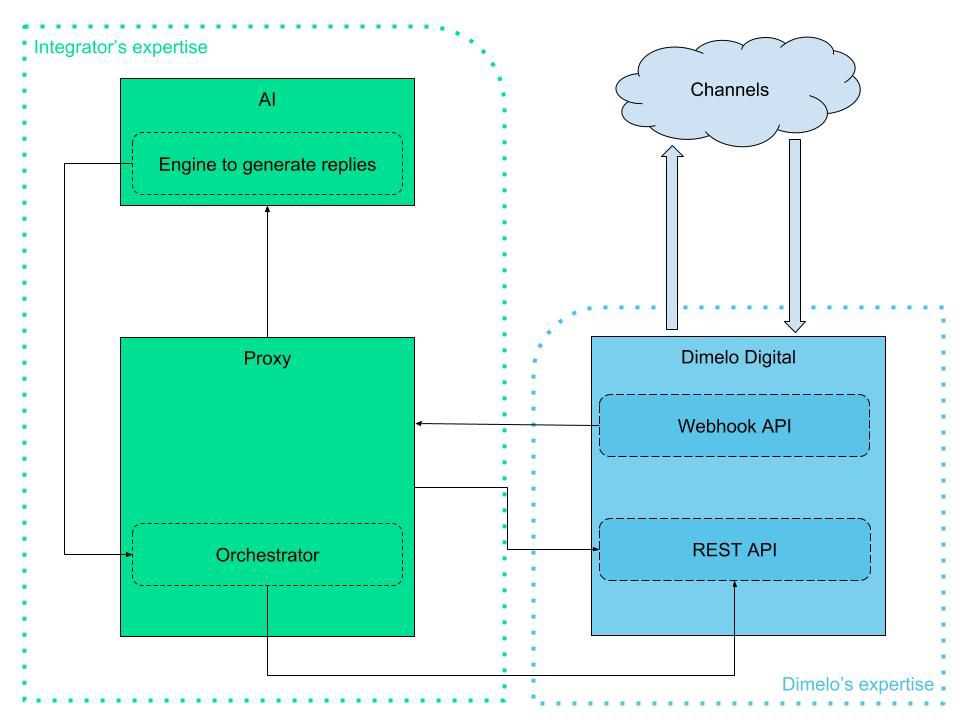

# Dimelo Digital - Chat Bot integration guide

## Intention

The aim of this document is to describe the process of integrating a multi-channel bot into the Dimelo Digital platform. The tasks used to connect a bot to one of Dimelo’s sources can be used again for other sources.

Dimelo recommends using bots on private channels or at least on a third-party source connected via SDK. However Dimelo does not recommend its upload on public platforms such as Facebook, Twitter, etc because automatic messages are often banned.

A bot allows you to:

* prequalify a client inquiry
* take care of a request with low added-value
* retrieve information necessary to the processing of the request by an agent

**Please note: To this day Dimelo only supports messages in plain text format, Dimelo does not support enriched messages or HTML within the integration of a multi-channel bot. Dimelo is currently studying an extension to support enriched messages.**

The process of integrating a multi-channel bot that Dimelo recommends is described below.

## Prerequisites

This document aims to describe the process of integration of a multi-channel bot within Dimelo’s architecture. It does not describe the operating of the tools used for the integration nor does it explain the life-cycle of messages within Dimelo Digital. A thorough knowledge of Dimelo tools and of its operating is necessary to comprehend the entire process described in this documentation.

Below is a list of documentation that we recommend you read carefully beforehand:

* **DD Webhook API:** Functionality that allows automatic events concerning the message’s life-cycle from Dimelo Digital Platform to be sent to a predefined url
  * Documentation:​ ​https://bit.ly/dimelo_webhook_api
* **DD REST API:​** Dimelo Digital’s API which allows to retrieve data stored in it.
  * Documentation:​ ​https://bit.ly/dimelo_REST_API

## Functioning

The process of integrating a multi-channel bot prescribed by Dimelo is described below. In order to complete it effectively, the intervention of an external integrator and potentially of other contractors may be necessary. All interactions and actions between Dimelo Digital and the other components must transit through a proxy, which can be either included within the bot or be the link between the bot’s API’s and Dimelo’s. The proxy will be in charge of retrieving events sent by Dimelo, to generate API requests necessary to the interaction between Dimelo and the IA, and to format answers generated by the IA, etc.



The main advantage of this architecture is the flexibility of integration it allows to the intermediary, the proxy, installed between the Dimelo environment and the AI.


### Description of the components

You will find below the description of different elements composing the integration architecture of a multi-channel bot between the Dimelo Digital tool and the AI.

#### Dimelo Components

The detail of the components managed and/or provided by Dimelo is explained here:

**Dimelo Digital:**

Dimelo Digital is a platform within which your customer care agents connect in order to answer messages that are routed to them from varied connected channels. The platform allows you:

* To insure a consistent level of service for all customers by orienting the inquiries according to your SLA, customer’s profiles, and the availabilities of your resources.
* To streamline all different flux descended from social media, emails, forums, etc in order to guarantee an efficient operating system, traced exchanges, and treatment of interactions on a larger scale.
* To give you the tools to become more efficient and to pleasantly surprise your customers which will turn them into your first ambassadors. To go from one social identity to another to answer customers wherever they find themselves.
* To promote a better processing of customer inquiries by rerouting messages to the appropriate experts, suggesting answers, and filtering messages hindering the processing of the request since Dimelo Digital is established on a self-learning algorithm to identify the reasons of contact.

*Webhook API:* API sending automatic events linked to the life-cycle of messages managed by agents towards an established endpoint. For example, an event is automatically sent when a message arrives in the Dimelo Digital platform. The event is sent by HTTP request in JSON format and contains the message’s data (type of action carried out, date of the action, information specific to the message, ...).

*REST API Dimelo Digital:* API that enables to access data stored in Dimelo Digital. To access this data you need to acquire a valid ID token and have all the rights entitling you to access the information you are looking for. This API will retrieve the data relative to customer advisors, different user entities (Facebook, Twitter, Forum,...), interventions, messages,...

This component can be useful to retrieve additional data that might not have been correctly sent to the proxy through Dimelo Digital via Webhook events.

#### Components integration/bot

The components managed and/or provided by the integrator are specified in this section.

**AI:**

Component that generates answers automatically depending on the messages submitted by the proxy. This component can replace the agent for a first-level treatment of customer inquiries. In the case where the component is no longer able to answer, the conversation will be transferred to an agent.

**Proxy:**

Server hosting an app (server-side), this component is at the heart of the integration of Dimelo Digital and the AI. This component is in charge of nearly all the interactions between Dimelo Digital and the AI:

* Inboxing events and generating automatic actions from the AI’s side
* Recovering additional data via APIs that Dimelo provides
* Relaying messages received by Dimelo Digital towards the AI
* Formating answers that the AI will give
* Send answers generated by the AI to Dimelo Digital

*Recommendation:​* The proxy must be accessible in HTTPS format for obvious privacy reasons, to encrypt the stream of data travelling between the component and Dimelo Digital.

### Implementation

Below is the detail of the different informations you will have to provide while initializing the multi-channel bot, as well as the outlines of each part and the condition tests to be done at the moment of launching of the integration.

#### Data to submit

A certain amount of data and actions are required to launch a multi-channel bot integration project, outside of the information relative to the setup of Dimelo Digital. These informations are listed below by party:

**On Dimelo’s part:**

* Account to access Dimelo Digital
* Token with all the necessary clearances to access Dimelo Digital’s APIs
Implementation

**On the integrator’s side**

* List of requested events and endpoint for the usage of API webhook
* Information relative to the setup of a bot agent account
* Categories allowing to go from a bot conversation to an agent

#### Outlines

Below are the outlines of steps to follow for each part of the integration process of a multi-channel bot:

**On Dimelo’s part**

* Configuration specific to Dimelo’s tools (creation of accounts, webhook configuration, APP SDK configuration, API access creation,...)
* Provide documentation detailing Dimelo’s tools
* Support to technical teams engaged in the integration alongside Dimelo tools on the
client’s part.

**On the integrator’s part:**

* Setup of the proxy and of all the actions linked to this (inflow supervision, API calls, logic application, liabilities management)
* Setup of the API initiating automatic answers

#### Bot to agent transfer

In the case where the bot is no longer able to answer, the proxy will transfer the conversation to an agent. This transfer is managed by Dimelo via a modification of category. By default, conversations managed by the bot will have a category accessible only by the agent responsible for the bot. During the transfer, it is necessary to recategorize the conversation by using a category accessible to agents. The integrators can use this solution to implement the handover.

**Recategorizing the conversation thread via API:**

The integrator must recategorize the thread via REST Dimelo API (see section technical integration > Recategorizing a conversation). The integrator must attribute an available category so that the conversation is visible to agents.

#### Testing process

During the testing process, it is recommended to use a source for the test. This allows to test the integration of the multi-channel bot on Dimelo’s side in the real conditions of production without impacting all agents already using Dimelo Digital.

### Process of integration

In the setting of the integration of a multi-channel bot, two movements of integration must be expected during the developing phase. The processes of a successful case and of a failure case are described below.

#### Successful scenario

The successful case for the integration of a multi-channel bot within the Dimelo Digital tool corresponds to the process during which the AI manages to formulate a reply to the message sent by the proxy. This process unfolds as follows:


**Recap of the process:**

1. Dimelo Digital receives a message.
2. The API Webhook sends automatically an event informing the proxy that a message was received in Dimelo Digital, this event contains the information linked to the received message.
3. The proxy retrieves additional information if necessary via API REST Dimelo Digital
4. The proxy sends the information collected to the AI via the Webhook.
5. The AI formulates an answer according to the data it has received
6. The AI conveys the generated answer to the proxy
7. The proxy formats the answer
8. The proxy injects the formated answer in Dimelo Digital via the REST APIs
9. The answer is transferred to the customer via the Dimelo digital synchronizer.

[Optional] The “agent answers” generated by the API do not open automatically an intervention (processing of a customer message by an agent) within Dimelo. However, it is possible to create an intervention via API to follow the statistics on the bot’s procedure and allow traceability of interventions in the CRM.

#### Failure scenario

The failure scenario of the integration of a multi-channel bot within the Dimelo Digital tool corresponds to the process during which the AI is not able to generate an answer to the message sent by the proxy. This process is explained below:


Recap of the process :
1. Dimelo Digital receives a message
2. The Webhook API sends automatically an event informing the proxy that a message has been received in Dimelo Digital, this event contains information regarding the received message.
3. If necessary, the proxy gathers additional information via the REST Dimelo Digital API
4. The proxy sends the data collected via the Webhook to the 
5. The AI fails to generate an answer
6. The AI notifies the proxy of failure to generate an answer
7. The proxy takes into account the AI’s failure
8. The proxy recategorizes the conversation involved via the REST Dimelo Digital API or via Dimelo’s guidelines engine by filtering with context specific data
9. An agent takes over the thread recategorized by the proxy
10. The agent’s answer is transmitted to the customer via Dimelo Digital’s synchronizer

## Technical integration

This part will deal with the different steps of a minimal technical integration that need to be put in motion on the integrator’s part. The elements described below allow different interactions summarized by successful scenarios and failure scenarios of the integration process of a multi-channel bot. It is however possible to integrate new interactions to answer operating needs, you will find the detail of how to do so in our technical documentation Webhook and REST API of Dimelo Digital.

### Webhook integration

Dimelo Digital includes a push API called Webhook which is used to notify an endpoint defined in real-time when a specific event occurs within the interface (message import, categorization of conversation thread, agent takes charge of a task, etc.)

#### Configuration

To configure the Webhook on Dimelo’s side, it is necessary to provide us with an endpoint towards which we can send events. Once this endpoint is provided, Dimelo will be able to configure the Webhook in order to transfer to you an event for each message imported on the channels managed by the bot. Once this configuration is setup, Dimelo will provide a secured token to use to validate the endpoint as described below.

#### Validation of the endpoint

The first thing to setup after the configuration of the Webhook is the reply to the validation request sent during the activation of the webhook, the request is in the following format:

HTTP GET request in the following format:

HTTP GET: ​`https://{endpoint client}?hub.mode=subscribe&hub.challenge={string aléatoire}&hub.verify_token={token provided by Dimelo}`

You must setup the following actions at the reception of the validation request:

* Check that the hub.mod parameter is equal to “subscribe”
* Check that the hub.verify_token parameter corresponds well to the token provided by Dimelo
* Reply with a status 22 and a body containing only the value transferred in the
parameters of `hub.challenge`

You can view an example of a reply to the validation request on a webhook of test setup by Dimelo:

`https://webhook-sample.herokuapp.com/dimelo-digital-prod/endpoint?hub.mode=subscribe&hub.challenge=jfkjdsvfqgbqsvbfqkv&hub.verify_token=xxxxxxxxxxxxxxxxx`

#### Managing events

Once the validation request has passed you will begin receiving events linked to the importation of messages in Dimelo on the channels concerned by the bot. The alerts will be in the following format:

**HTTP POST containing a JSON request in the following format:**

```json
{
  "id":"50df05692c64ac7799f09a98",
  "domain_id":"48cc6703bdae1462ce06a555",
  "events":[
    {
      "type":"content.imported",
      "id":"5950328914bf8a22305f446a",
      "issued_at":"2017-06-25T22:00:41.339Z",
      "resource":{
        "type":"answers/private_message",
        "id":"5950328814bf8abf7f79e3cb",
        "metadata":{
          "approval_required":false,
          "author_id":"536cbd9e7aa58d58f3000050",
          "body":"This is just one more test email, sent automatically",
          "body_input_format":"text",
          "creator_id":null,
          "date":"2017-06-26",
          "first_in_thread":false,
          "foreign_categories":[

          ],
          "foreign_id":"1056855",
          "has_attachment":false,
          "intervention_id":"541014eea90ffb3f600000ac",
          "in_reply_to_author_id":"4dcceb1f2f1a692a2a000057",
          "in_reply_to_id":"541015010f4ca111df0000b0",
          "source_id":"4f97fbea7aa58d073900344f",
          "status":"assigned",
          "thread_id":"541014e17aa58d8ccf000024",
          "thread_title":"This is a nagios check thread, please don't delete!",
          "created_from":"synchronizer",
          "private":true
        }
      }
    }
  ]
}
```

**Please note:** ​You must answer all events received by a status 200, otherwise the webhook will consider you have not received it and will send it again. After 10 unsuccessful trials spread out on 24 hours, the Webhook will be automatically disabled.

**When you receive an event from the Webhook you must transfer the contents of the message to the IA so that it can generate an appropriate answer.**

For more information on the way the webhook works or on the entirety of the events available, please refer to the documentation dedicated to the Dimelo Digital Webhook.

### API REST integration

Dimelo Digital provides its clients with a REST API to carry out actions in your agents’ system platform remotely. This system platform can be used during the integration to create an agent reply generated by the AI, to check in real time the availability of your agents in Dimelo, to recategorize conversations in Dimelo in order to re-attribute it to counselors, etc. You will find below the description of API calls to setup on the integrator’s part in order to execute these actions.

#### Configuration

In order to be able to use Dimelo Digital’s REST APIs, Dimelo needs to provide you with the following information:

* API endpoint of your Dimelo Digital authority
* Token access linked to your agent account

Please remember that the access token provided by Dimelo is associated to your agent account and therefore to its authorizations. In case of error 403 on the API, do not hesitate to contact your project manager so that he can update the authorizations of the counselor account linked to the access token.

#### Creating a bot reply

In the successful scenario where the AI is able to answer a customer inquiry sent to the proxy via a Webhook event, ​**it is necessary that the proxy generates an agent reply using Dimelo Digital’s REST APIs.** ​To complete this task, you have to generate the following requests:

Recap of an API request:

**Creating content**

This method allows you to create new content. It can be a reply to another content or content that initiates discussion. It use token’s user as content user. Content will be created in Dimelo Digital, but not yet pushed synchronously into external source.

* **HTTP method:​** `POST`
* **Path:​** `/1.0/contents`
* **Pagination:​** no.
* **Extra parameters:**
  * `author_id`: The identity id of content. This parameter is not mandatory, by default it use the token’s user first identity on source.
  * `body`: The content’s body. This parameter is mandatory.
  * `in_reply_to_id`: The content’s id you want to reply to. If omitted, a new discussion will be
created. If source does not support to initiate discussion this parameter is mandatory.
  * `private`: Created contents are public by default, set this parameter to "1" in order to create a private reply.
  * `source_id`: The source to create content to. If you specify `in_reply_to_id` parameter,
source will be determined from. Otherwise, this parameter is mandatory.
* **Authorization:** only users that can reply or initiate discussion on given source. it renders also an error if in_reply_to isn’t synchronized or if in_reply_to content is not under an open intervention.

Reply format:


```json
{
  "id":"73f1cb2938229d7fa222d096",
  "source_id":"d19c81948c137d86dac77216",
  "source_url":"http://domain-test.answers.dimelo.com/questions/42",
  "source_type":"answers",
  "thread_id":"26c56bc5b71c5193b6f8c656",
  "author_id":"4f0aa52d656a3d75867f784c",
  "creator_id":"ac24dc966bc7ecb74017c0cd",
  "foreign_id":"7789",
  "type":"question",
  "created_from":"synchronizer",
  "private_message":false,
  "status":"replied",
  "intervention_id":"7f946431b6eebffafae642cc",
  "language":"fr",
  "body":"Hello,\n\nHow to unlock my nokia 3210?\n\nThanks!",
  "body_formatted":{
    "text":"Hello,\n\nHow to unlock my nokia 3210?\n\nThanks!",
    "html":"<p>Hello,</p>\n\n<p>How to unlock my nokia 3210?</p>\n\n<p>Thanks!</p>"
  },
  "body_input_format":"text",
  "title":"Nokia 3210 unlocking",
  "attachments_count":1,
  "attachments":[
    {
      "id":"5464b5c04d61639684110000",
      "created_at":"2011-05-05T22:00:00Z",
      "updated_at":"2011-05-05T22:00:00Z",
      "content_type":"application/pdf",
      "size":174784,
      "filename":"sso.pdf",
      "foreign_id":"123",
      "url":"​http://domain-test.engagement.dimelo.dev/attachments/5464b5c04d61639684110000​"
    }
  ],
  "synchronization_status":"success",
  "category_ids":[
    "4d0fb475b242228033cbdf6d",
    "60944e5702bdafb74ac96141"
  ],
  "created_at":"2012-05-24T04:00:44Z",
  "updated_at":"2012-05-24T04:00:44Z",
  "approval_required":false,
  "remotely_deleted":false,
  "published":true
}
```

Request example:

`curl -X POST -d "source_id=58ff349313047d2cf6f&in_reply_to_id=58ff349313047d2cf6f&&body=test de contenu" "https://xxxxxxxxx.api.engagement.dimelo.com/1.0/contents?access_token=yyyyyyyyyyy"`

*Parameters to transfer*

* access_token :​ API identification token
* Parameters linked to creating content

#### Creation of a bot intervention

It is possible to create an intervention via API upon the first bot answer to a customer inquiry. This allows traceability in the CRM in the case where the bot manages the entirety of the conversation without turning to an agent. This allows also to boost statistics linked to interventions from the initial processing by the bot. In order to undertake this action, you must setup the following request:

Description of the API request:

**Creating an intervention**

This method creates a new intervention or reopen it. In case of success it renders the intervention, otherwise, it renders an error (422 HTTP code). This method opens intervention as access token’s user.

* **HTTP method:​** `POST`
* **Path:​** `/1.0/interventions`
* **Pagination:**​ no.
* **Extra parameters:**
  * `content_id`: The content to create intervention on (mandatory).
  * Authorization: no, but it renders an error if intervention can’t be created or reopened (already opened, etc.).

Format of the answer:


```json
{
  "id":"3f55c8330da4144afd1c6728",
  "created_at":"2012-05-21T01:15:28Z",
  "updated_at":"2012-05-21T01:19:49Z",
  "source_id":"f18c81948c137d86dac77216",
  "thread_id":"9c9903dc3d559a8801eb5441",
  "content_id":"c93e3586250ff60181b6c2f0",
  "deferred_at":"2012-05-21T01:18:49Z",
  "identity_id":"8a8deed44623a4c44268c266",
  "comments_count":1,
  "closed":false,
  "closed_at":"2012-05-24T02:00:32Z",
  "custom_fields":{
    "external_id":"342901"
  },
  "category_ids":[
    "4d0fb475b242228032cbdf6d",
    "59248c4dae276a021cb296d2"
  ],
  "user_id":"d033e22ae348feb5660fc214",
  "user_replies_count":1,
  "user_reply_in_average":84959,
  "user_reply_in_average_bh":63000,
  "user_reply_in_average_count":1,
  "first_user_reply_id":"573446514379728247000001",
  "first_user_reply_in":0,
  "first_user_reply_in_bh":0,
  "last_user_reply_in":0,
  "last_user_reply_in_bh":0,
  "status":"Fermée"
}
```

Example of a request:

`curl -X POST "https://xxxxxxxxx.api.engagement.dimelo.com/1.0/interventions?access_token=yyyyyyyyyyy&content_id=c93e3586250ff60181b6c2f0"`

Parameters to transfer:

* `access_token`:​ API identification token
* `content_id`:​ Content’s ID to which the intervention is to be associated

#### Closing a bot intervention

In the case where you would have opened a bot intervention via API, it is also possible to close this intervention via API when the support is ended. This will allow to close the intervention when the bot is fully capable of managing the entirety of the conversation or when the customer disconnects at some point during the conversation. To complete this task you must setup the following request:

Description of the API request:

Closing an intervention

This method closes an intervention.

Caveats:

If the intervention is already being closed, it will return a 409 error.
To be able to close an intervention, it must meet the following criteria otherwise a 403 will be raised:

* Intervention MUST NOT already be closed
* Intervention MUST have agent replies
* Access-Token agent MUST be the owner of the intervention or have the permission to
edit permissions
* Access-Token agent MUST have read access on the source

* **HTTP method:​** `PUT`
* **Path:​** `/1.0/interventions/:id/close`
* **Pagination:​** no.
* **Authorization**:​ no, but it renders an error if intervention can’t be closed (see caveats)

Format of the reply:

```json
{
  "id":"3f55c8330da4144afd1c6728",
  "created_at":"2012-05-21T01:15:28Z",
  "updated_at":"2012-05-21T01:19:49Z",
  "source_id":"f18c81948c137d86dac77216",
  "thread_id":"9c9903dc3d559a8801eb5441",
  "content_id":"c93e3586250ff60181b6c2f0",
  "deferred_at":"2012-05-21T01:18:49Z",
  "identity_id":"8a8deed44623a4c44268c266",
  "comments_count":1,
  "closed":false,
  "closed_at":"2012-05-24T02:00:32Z",
  "custom_fields":{
    "external_id":"342901"
  },
  "category_ids":[
    "4d0fb475b242228032cbdf6d",
    "59248c4dae276a021cb296d2"
  ],
  "user_id":"d033e22ae348feb5660fc214",
  "user_replies_count":1,
  "user_reply_in_average":84959,
  "user_reply_in_average_bh":63000,
  "user_reply_in_average_count":1,
  "first_user_reply_id":"573446514379728247000001",
  "first_user_reply_in":0,
  "first_user_reply_in_bh":0,
  "last_user_reply_in":0,
  "last_user_reply_in_bh":0,
  "status":"Fermée"
}
```

Example of a request:

`curl -X PUT "https://xxxxxxxxx.api.engagement.dimelo.com/1.0/interventions/3f55c8330da4144afd1c6728/cl ose?access_token=yyyyyyyyyyy"`

Parameters to transfer :

* `id`:​ ID of the to be closed intervention
* `access_token`:​ API identification token

#### Closing a thread

It is possible yet optional to close a thread via API, this will block the agent from replying again on the thread in question. In the case where the user disconnects during the conversation the agent no longer needs to answer. This can be achieved by activating the following request.

Description of the API request:

**Close a thread**

Starts a job to close a thread. It returns the thread but as the job is asynchronous, the state of the “close” attribute in the returned object do not is the one when the job started.

If token’s user does not have “read” on thread’s source a 404 HTTP response will be returned. Returns a 403 if the thread cannot be closed or if the user does not have the permission to close a thread.

* **HTTP method:​** PUT
* **Path:​** `/1.0/content_threads/:id/close`
* **Pagination:​** no.
* **Authorization:​** no.

Format of the reply:

```json
{
  "id":"9c9903dc3d559a6801ec5441",
  "source_id":"d19c81948c137d86dac77216",
  "title":"ADSL modem iss1ue",
  "interventions_count":1,
  "contents_count":4,
  "closed":false,
  "category_ids":[
    "4d0fb475b242228a32cbdf6d",
    "59248c4dae276a041cb296d2"
  ],
  "thread_category_ids":[
    "4d0fb475b242228a32cbdf6d"
  ],
  "extra_data":{
    "custom_my_number":123456,
    "trigger_id":"foo"
  },
  "foreign_id":"ab-2031",
  "created_at":"2012-05-18T14:24:44Z",
  "updated_at":"2012-05-21T18:10:12Z"
}
```

The `extra_data` field depends on the source type. For more informations, please refer to the exports documentation.

Example of a request:

`curl -X PUT "https://xxxxxxxxx.api.engagement.dimelo.com/1.0/content_threads/9c9903dc3d559a6801ec544 1/close?access_token=yyyyyyyyyyy"`

Parameters to transfer:

* `id`:​ ID of the thread to be closed
* `access_token`:​ API identification token

#### Agent availabilities

In the failure scenario where the AI is not able to answer a customer inquiry sent to the proxy via a Webhook event, ​**it is imperative that the proxy checks the availability of the agents with the REST API in order to determine if it is possible to redirect the conversation to an agent.** To execute this action you must activate the following request:

Description of the API request:

**Get all connected agents status**

This method get all currently connected agents & their status.

* **HTTP method:​** GET
* **Path:**​ `/1.0/status`
* **Pagination:​** no.
* **Authorization:**​ only users that have the right to monitor the task view.

Format of the answer:

```json
[
  {
    "agent_id":"4f4f3a08a90ffb27ee000583",
    "channels":[
      {
        "id":"55794bd9416472d4e8050000",
        "name":"Async",
        "status":"available",
        "busyness":"busy"
      },
      {
        "id":"55794bda416472d4e8060000",
        "name":"Realtime",
        "status":"available",
        "busyness":"unoccupied"
      }
    ],
    "custom_status":null
  }
]
```

1. null — ​the agent is not connected on this channel
2. `available` — ​The agent is available (green/yellow/orange dot)
3. `away` — ​The agent is away (red dot)

Possible values for the `busyness` attribute are:

1. `unoccupied` — ​The agent don't have any task in progress on this channel
2. `ok` — ​The agent has less task in progress than the soft limit allows (green dot)
3. `busy` — ​The agent has more task than the soft limit allows (yellow dot)
4. `full` — ​The agent is at full capacity / hard limit (orange dot)

The `custom_status` attribute represent the custom `away` status selected, it can either be:

1. null — ​The agent is available or in the generic "Away" status
2. `{ "id":"5582b1f4776562af9b000008" }` — ​The id of the custom status

In order to determine if an agent is available or not, you need to verify the following

* `name` = Name of the channel containing the targeting source
* `status` = available
* `busyness` ≠ full

You need to concentrate only on the channel including the targeted source because it will include the agents in charge of answering received messages. The agents needs to be available (status=available) and not have yet reached its full capacity of processing (busyness=full).

Example of a request:

`curl "https://xxxxxxxxx.api.engagement.dimelo.com/1.0/status?access_token=yyyyyyyyyyy"`

Parameters to transfer :

* `access_token`:​ API identification token


### Recategorizing a thread

In case of a failure scenario during which the AI is not able to answer a customer’s inquiry sent to the proxy via a Webhook event, and that agents are available to overtake the conversation, **the proxy needs to recategorize the thread managed by the bot with the REST Dimelo APIs in order to redirect the thread to an agent.** To complete this task you need to create the following request :

Description of the API request:

**Categorizing a thread**

This method updates the categories of a thread. If token’s user does not have “read” on thread’s source a 404 HTTP response will be returned. If the thread is already being categorized, a 409 HTTP response will be returned.

* **HTTP method:​** `PUT`
* **Path:​** `/1.0/content_threads/:id/update_categories`
* **Pagination:​** no.
* **Authorization:​** no.
* **Extra parameters:**
  * `thread_category_ids`: An array containing the new categories to set on the thread.

Format of the answer:

```json
{
  "id":"9c9903dc3d559a6801ec5441",
  "source_id":"d19c81948c137d86dac77216",
  "title":"ADSL modem iss1ue",
  "interventions_count":1,
  "contents_count":4,
  "closed":false,
  "category_ids":[
    "4d0fb475b242228a32cbdf6d",
    "59248c4dae276a041cb296d2"
  ],
  "thread_category_ids":[
    "4d0fb475b242228a32cbdf6d"
  ],
  "extra_data":{
    "custom_my_number":123456,
    "trigger_id":"foo"
  },
  "foreign_id":"ab-2031",
  "created_at":"2012-05-18T14:24:44Z",
  "updated_at":"2012-05-21T18:10:12Z"
}
```

Example of a request:

For more information concerning the functioning of Dimelo Digital’s REST API and the entirety of the endpoints available, please refer to our documentation dedicated to Dimelo Digital’s REST API.

`curl -X PUT -d "thread_category_ids[]=58ff349313047d2c&thread_category_ids[]=4d0fb475b242228a32cbd" "https://xxxxxxxxx.api.engagement.dimelo.com/1.0/content_threads/9c9903dc3d559a6801ec544 1/update_categories?access_token=yyyyyyyyyyy"`

Parameters to transfer:

* `id`:​ ID of the conversation thread to recategorize
* `access_token`:​ API identification token
* `thread_category_ids[]`:​ IDs of the categories setup on the conversation thread

For more information concerning the functioning of Dimelo Digital’s REST API and the entirety of the endpoints available, please refer to our documentation dedicated to Dimelo Digital’s REST API.