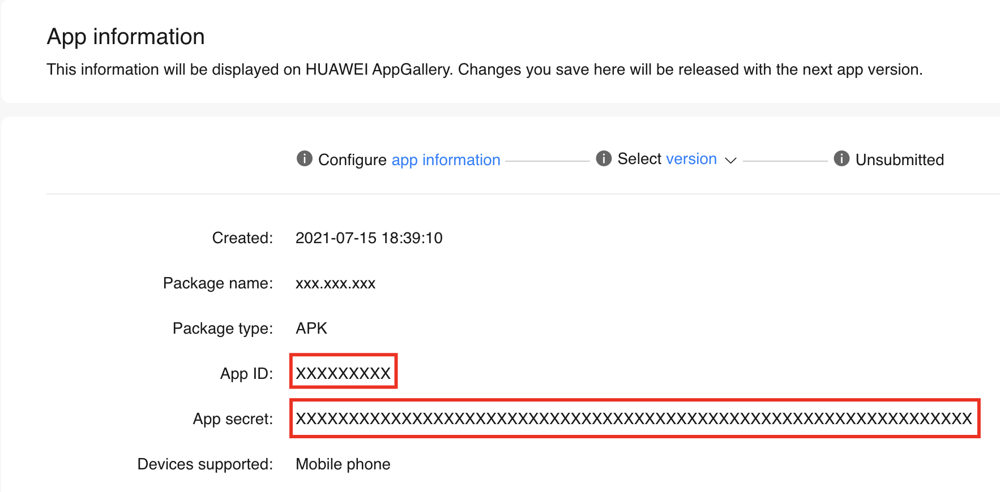
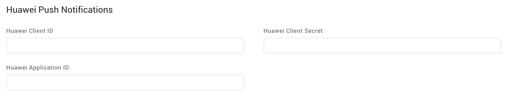

# Huawei Push Notifications

The [Engage Digital Messaging Android SDK](https://github.com/ringcentral/engage-digital-messaging-android) supports sending push notifications to Huawei service based devices using [Huawei Push Kit](https://developer.huawei.com/consumer/en/hms/huawei-pushkit).

To enable this feature you first need to follow [this guide](https://developer.huawei.com/consumer/en/doc/development/HMSCore-Guides/android-config-agc-0000001050170137) which describes how to create a Huawei developer account, a project for your app and how to enable the Push Kit API.

 

Then head to the "App information" section of your AppGallery Connect and retrieve the "App ID" and "App secret":

  

Once you have both the "App ID" and the "App secret" you will need to use them to fill the "Huawei Client ID", "Huawei Client Secret" and "Huawei Application ID" fields in the Engage Digital Messaging channel configuration interface:

  

The "Huawei Application ID" field should be filled with the "App ID".

The "Huawei Client ID" and "Huawei Client Secret" fields should - in most cases - be filled with, respectively, the "App ID" and the "App secret". However if, for some reason, you create separated credentials for the Push Kit API you can use them to fill the related fields in Engage Digital.
