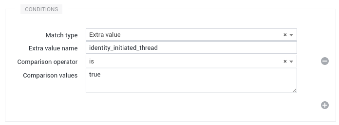

# Introduction to Web Messaging

A customer of RingCentral Engage wants to have a Chat integrated in a website, called the **target website**, in order for their own visitors/customers, called the **visitors**, to get assistance or to proactively provide them with assistance. For that purpose, an instance of RingCentral Engage is configured to have a RingCentral Engage Messaging source. An integration is done in the target website to setup the required code, and the final configuration is done in RingCentral Engage by a trained administrator or by an expert from RingCentral Engage. The officers of the customer handling the Chat conversations and responding to the visitors on RingCentral Engage are called the **agents**. The fact that a visitor sends a message via the Chat is called an **engagement** ‒ the Chat is said to have **engaged**.

!!! Note
    The principle of RingCentral Engage Messaging is to have an integration step in the target website that is minimal. The possibility to configure precisely how and when the Chat is shown, directly in RingCentral Engage, without having to add another step of integration nor modify the existing integration, will provide long-term value to our customer.

## Architecture of the Client

On the target website, we insert a short javascript code that will load a javascript script called “the loader”.

Depending on whether or not the Chat source is active, or in maintenance, the loader contains the required data to run or do nothing. Among the data is configuration data of the source and the customization, and some code to initialize things. Once loaded itself, the loader will asynchronously load the full javascript code of the Chat, configure things and start the session. The full javascript code is common for all our customers and the loader depends on each source configuration. 

The Chat client-side code is composed of two pieces:

* The Chat Client that renders the Chat window and handles the messaging
* The Chat Manager that is responsible for the triggers detection, the session tracking, displaying the items (buttons, invitations...) and launching the Client.

## Messaging Mode - Floating and Embedded Displays

When the chat is configured as Messaging, it has 2 display modes:

* **Floating**: Just like the Live Chat, the chat is displayed in a floating window on the bottom right of the website.
* **Embedded**: This mode allows you to integrate the chat in the flow of your website.

## Chat Display Logic

The Chat Manager has multiple triggers that, when verified, will show the Chat or some items. The triggers are evaluated in this order:

1. The embedded trigger
2. The continuation trigger
3. The messaging trigger
4. The configured trigger

If a trigger is verified, the following triggers won’t be evaluated. The first 3 triggers are hardcoded in the Chat Manager logic. The last one is to be configured in RingCentral Engage.

### The Embedded Trigger

This trigger is verified if the Chat is in **embedded** mode. It will directly display the embedded Chat.

### The Continuation Trigger

This trigger is verified if the Chat was shown and engaged on the previous page. It will re-display the Chat as it was before: minimized or open.

### The Messaging Trigger

This trigger is verified if:

* The Chat is in **messaging** mode.
* The Chat is not engaged.
* The current identity has at least one open thread.

It will open the Chat.

### The Configured Trigger

These triggers are configured within RingCentral Engage and don’t require modification on the target website.

A configured trigger is a rule, configured to take some actions upon some conditions:

* Client side conditions, configurable for each trigger, depending on the visitor session and on some custom variables. given
* Server side conditions depend on the presence and occupancy of agents.

The client side conditions implicitly include a condition on the fact that the Chat has not yet engaged.

When client side conditions are met, the trigger is said to be **activated**. Then:

* If the trigger is configured as **“Execute only if agents are available”**: The Client reaches the Server to obtain a probability to take the configured actions. The Server calculates it depending on the presence of agents, and their workload. The Client draws and executes or not the actions. Currently, probabilities are only 0 (no) and 1 (yes), but in the future, a probability between 0 and 1 could be instructed to obtain a fine grained traffic.
* If the trigger isn’t configured as **“Execute only if agents are available”**: The Client directly executes the actions without consulting the Server.

At least one trigger is required, even if it has no condition. It is then always met. If the trigger is configured as “Execute only if agents are available”, then the actions are executed depending only on the server side conditions: agents are available to engage or not.

#### Online / Offline Modes (Live Chat mode only)

The Buttons and Invitations items support the distinction between the online and offline modes. When this support is enabled, such items will always be shown after the corresponding trigger is activated. When the Client executes the trigger, the items are rendered with the online mode, and with the offline mode otherwise.

On the Messaging mode, the online mode will always be used.

### Chat Items

The triggers are configured with actions to take, and most actions consist of showing an item on the target website, or directly opening the Chat window.

The Chat Items are of two kinds: Buttons and Invitations. They are created and customized directly in RingCentral Engage and usually don’t need integration on the target website. They are actionable and aim to open the Chat window.

### Continuation

The items and the Chat window are displayed by a Trigger for the current page only, leaving the same or another Trigger to display them again on the next page view if needed.

However, the Chat window has a built-in continuation rule: if the visitor engages the conversation by sending a message, the Chat window will continue to be shown during the navigation until:

* On Live Chat: the visitor ends the Chat session or the visit idle duration has passed (24 hours)
* On Messaging: the visit idle duration has passed (24 hours)

During the engagement, no other trigger can be activated, thus, no other item can additionally be displayed.

## Chat Session and Data

From the beginning of their visit, at each page view, and during a page view, a visitor is tracked by
the Chat Manager. Navigation data, timings, counts, and custom data are recorded to make a history.

This collection of data happens on the client side only. The data is stored in the visitor’s browser (more precisely in its “localStorage”) and is not seen by the server.

The data collected serves for the triggers’ conditions. They are matched against this data.

The collection of data is steady, i.e. it doesn’t only happen at the beginning of each page view. Meaning that we natively support things that change while the page remains the same (javascript action, form fields filled, elements appearing…).

Once the Chat client is shown to the visitor, when he engages, the part corresponding to the current page viewed is sent to the server to be displayed in RingCentral Engage, alongside the conversation. This allows agents to have a context about the visitor activity on the website. Then, as the visitor continues his browsing, the session data is updated and sent to the server to refresh the context data the agents see.

### Custom Variables

Custom variables are defined in RingCentral Engage and are populated with data given to the Chat Manager by an integration on the target website, or by data found by the Chat Manager itself on the pages of the target website.

A custom variable can be:

* the amount of a cart,
* the product name seen on the page,
* whether or not the visitor is logged in,
* the product currently subscribed to by the visitor…

Custom variables are ways to offer more discriminance for the triggers (through more segmentation possibilities), and to convey more information to the agent once the visitor is engaged (for context).

### Automatic Context Data on Conversations Started by the User

On the Messaging mode, the user can start a new conversation on his own by clicking on the new conversation button in the conversations listing. For these conversations, we automatically set a context data “identity_initiated_thread” at “true” that can be used to detect them.

This can be used in the Rules Engine for some custom processing:

## Visitor Identification

When the Chat is shown and connects to the server, a new Identity is created in RingCentral Engage, belonging to the Engage Messaging Community linked to the Engage Messaging source.

By default a visitor is anonymous. A new Identity with no information is created.

We offer a mechanism, with an integration on the target website, to register data about the visitor: their name, their email address, an avatar… and some extra values.

### Extra Values

The RingCentral Engage Messaging source allows for an identity to store extra values. Every extra value registered about the visitor from the Chat client is sent to the Server and is stored in the Identity.

In the configuration of the related Engage Messaging Community in RingCentral Engage, a mapping can be setup to map those extra values to the Custom Fields defined in RingCentral Engage, like with any kind of Community that provides extra values (RingCentral Engage Mail, RingCentral Engage Chat, RingCentral Engage Communities…).

### User Persistent Identifier (aka UUID)

Every customer using Chat has an internal ID in RingCentral Engage. This ID's purpose is to link different conversations to the same customer so that the Agent and the Company can track history and usage of the chat Channel.

#### Automated RingCentral Engage UUID

This is the default configuration. RingCentral Engage Messaging automatically generates IDs (called UUID) for every new customer using the chat. RingCentral Engage persists this identifier hisotrically in the customer browser cache. If the customer empties its cache or switches browser or computer a new UUID will be generated and the new conversation will not be merged with the old one. Basically at the RingCentral Engage level this will be a brand new customer even if the person has the same name and attributes as another one.

A good advantage of this mode is that it handles nicely, the situation when visitors start a Chat session as anonymous and then log in during the session. The identity remains the same and is just updated with the newly available information and the conversation is not interrupted.

#### Company Managed UUID

If your customers are always authenticated we strongly recommend having a customer identifier registered under the “uuid” identity field. This would allow grouping this chat with other chats previously opened by this same physical customer, based on this ID.

The ID used can be the customer ID, an ID from a CRM, or the ID of an SSO system or any stable and unique ID that could be assigned to a particular client.

If the ID is needed by the agent to perform some operations (e.g. searching the customer in a CRM using his ID), the customer ID should also be registered as an extra value in order to be displayed in the RingCentral Engage interface, or you can also [map the UUID directly into an Identity Group Field](./community/#map-the-uuid-to-an-identity-group-field).

!!! warning
    Since each chat is binded to an identity, identifying a visitor while a chat session is already open will result in the creation of a new chat session. So don’t use it if anonymous users are supposed to login as a customer during a chat session.

!!! important
    Don’t use guessable uuid if you do not rely on JWT to sign parameters or you could face customer impersonation.

## Messaging Mode Features

When the Engage Messaging source is configured in Messaging mode (not Live Chat), the Chat won’t be synchronous anymore. The differences with the Live Chat mode are the following:

* No more “connected” or “disconnected” events. Meaning that a conversation can last for days without any interruption.
* Closing an intervention won’t end the conversation, but a conversation can be locked and unlocked.
* The user cannot end a conversation, only the agent can.
* The message history is shared between the web chat and the mobile.
* The user can have multiple conversations and create new ones too.
* The chat can be embedded.
* No cobrowsing.