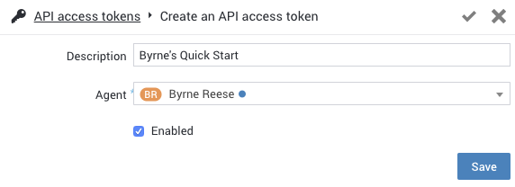

style: quick-start
no_breadcrumb:true

# Getting Started with Routing

Routing is a critical high-level concept with the RingCX Platform, as it handles how teams can share the work load across their agents and ecosystem. There are two primary ways in which workflows and workloads are managed: through a task-based system, and via folders.

All folders in RingCX are "smart folders" whose contents are determined by rules defined by an administrator. This helps drive transparency across teams, and facilitates greater collaboration.

Tasks provide a more directed way of designating a specific agent to be responsible for handling and resolving a customer interaction or intervention.

Welcome to the RingCX Platform. In this Quick Start, we are going to help you get a list of tasks that can be assigned to agents within your account. Obtaining a reference to a task by its ID is an important first step in managing the workflow of that task. This Quick Start will have you up and running in minutes.

## Obtain Access Key

The first thing you need to do is obtain an API Access Token if you do not already have one. Access tokens can be created and/or accessed via the "API access token" area in the "Admin" area of your RingCX portal.

??? tip "How to generate a RingCX API access token"

    1. Login to your RingCX portal and click on the "Admin" menu located in the top, horizontal menu.

    2. Select "API access tokens" towards the bottom of the left hand menu.

    3. You should see a list of access tokens if any have been provisioned. Select the token, or click the "+" button to create a new one.

    4. Finally, enter a label/description for your token, and select an Agent on which the token will act on behalf of. Make sure the token is "enabled" and click "Save."

          

Make note of the access token generated as you will need it later.

##### Choose a Language to Get Started

Send an SMS in less than five minutes:

=== "Javascript"

    Create a file called `tasks.js`. Be sure to edit the variables in &lt;ALL CAPS&gt; with your app's credentials.

    ```javascript
    {!> code-samples/routing/tasks.js !}
    ```

    ### Run Your Code

    You are almost done. Now run your script.

    ```bash
    $ node tasks.js
    ```

=== "Python"

    Create a file called `tasks.py`. Be sure to edit the variables in &lt;ALL CAPS&gt; with your app's credentials.

    ```python
    {!> code-samples/routing/tasks.py !}
    ```

    ### Run Your Code

    You are almost done. Now run your script.

    ```bash
    $ python tasks.py
    ```

=== "PHP"

    Create a file called `tasks.php`. Be sure to edit the variables in &lt;ALL CAPS&gt; with your app's credentials.

    ```php
    {!> code-samples/routing/tasks.php !}
    ```

    ### Run Your Code

    You are almost done. Now run your script.

    ```bash
    $ php tasks.php
    ```

=== "Ruby"

    Create a file called `tasks.rb`. Be sure to edit the variables in &lt;ALL CAPS&gt; with your app's credentials.

    ```ruby
    {!> code-samples/routing/tasks.rb !}
    ```
    ### Run Your Code

    You are almost done. Now run your script.

    ```bash
    $ ruby tasks.rb
    ```

## Need Help?

Having difficulty? Feeling frustrated? Receiving an error you don't understand? Our community is here to help and may already have found an answer. Search our community forums, and if you don't find an answer please ask!

<a target="_new" href="https://forums.developers.ringcentral.com/search.html?c=72&includeChildren=true&f=&type=question+OR+kbentry+OR+topic&redirect=search%2Fsearch&sort=newest&q=interactions">Search the forums &raquo;</a>

## What's Next?

When you have successfully made your first API call, it is time to take your next step towards building a more robust application.

<a class="btn btn-success btn-lg" href="https://developers.ringcentral.com/engage/api-reference/">Explore the REST API &raquo;</a>
