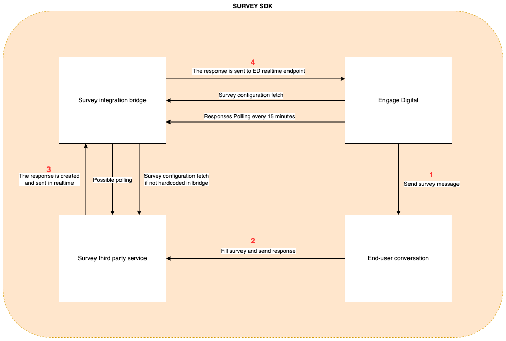

# Engage Digital Survey SDK

The Engage Digital Survey SDK is an easy way to integrate any kind of third party survey supplier into Engage Digital.
This guide is meant to provide developers with a comprehensive overview of the available features and with enough examples to make it simple to create an implementation for any system.

## Overview

In the following diagram the "Survey integration bridge" is the part you are responsible for and its job is to allow data from the third party survey provider to be formatted and forwarded to Engage Digital.

See [Getting Started](./quick-start.md) to start integrating your third party survey provider in Engage Digital.

