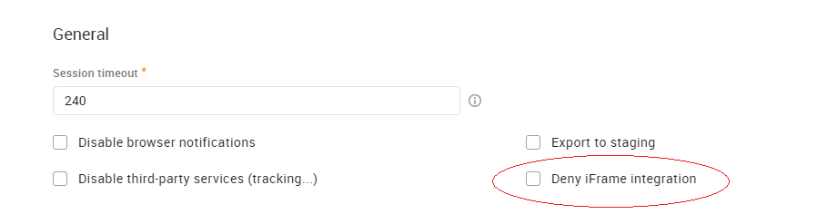

# About UI Embed

The embedded UI allows RingCentral Engage Digital to be integrated in third parties, external CRMs or other customer care products.

## Configuration

### Enable Iframe Integration

By default, iframe integrations are not permitted. To use the embedded UI, please have "Deny iFrame integration" unchecked. This parameter is available in Admin view -> Settings -> Security -> General:



## Integrate Iframe Component

Once enabled, you'll be able to integrate RingCentral Engage Digital into your system.

It will be done through the use of an iframe tag. The iframe's source attribute should be filled with the URL of RingCentral Engage Digital Digital page you're willing to integrate. Furthermore, you'll need to add the `view` parameter to the URL with the value `no-header`. For example, to integrate the push page into your system with a 1400*1000 iframe you'll need to add the following tag:

```html
<iframe src="https://{your-domain}.digital.ringcentral.com/tasks?view=no-header" width="1400" height="1000"></iframe>
```

### Events Subscription

After that you have successfully integrated RingCentral Engage Digital in an iframe you can subscribe to the events sent by it. The communication can be established through the Window web API, like this:

```html
<script type="text/javascript">
  window.addEventListener('message', function(event) {
    var name = event.data['name']; // Type: String, hold the event name
    var data = event.data['data']; // Type: Object, hold the event data
  });
</script>
```

Check out [more info on events](./events.md)
